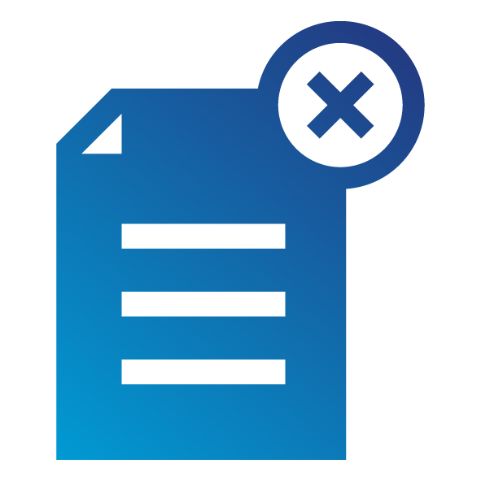

# A05:2021 – Configuración de Seguridad Incorrecta    {: style="height:80px;width:80px" align="right"}

## Factores

| CWEs mapeadas | Tasa de incidencia máx | Tasa de incidencia prom | Explotabilidad ponderada prom| Impacto ponderado prom | Cobertura máx | Cobertura prom | Incidencias totales | Total CVEs |
|:-------------:|:--------------------:|:--------------------:|:--------------:|:--------------:|:----------------------:|:---------------------:|:-------------------:|:------------:|
| 20          | 19.84%             | 4.51%              | 8.12                 | 6.56                | 89.58%       | 44.84%       | 208,387           | 789        |

## Resumen

Ascendiendo una posición desde el sexto puesto en la edición anterior, el 90% de las aplicaciones se probaron para detectar algún tipo de configuración incorrecta, con una tasa de incidencia promedio del 4% y más de 208.000 ocurrencias de CWEs en esta categoría de riesgo. Con mayor presencia de software altamente configurable, no es sorprendente ver que esta categoría asciendiera. Las CWE notables incluidas son *CWE-16 Configuración* y *CWE-611 Restricción incorrecta entidades externas referenciadas de XML*.

## Descripción 

La aplicación puede ser vulnerable si:

-   Le falta el *hardening* de seguridad adecuado en cualquier parte del *stack tecnológico* o permisos configurados incorrectamente en los servicios en la nube.

-   Tiene funciones innecesarias habilitadas o instaladas (puertos, servicios, páginas, cuentas o privilegios innecesarios, por ejemplo).

-   Las cuentas predeterminadas y sus contraseñas aún están habilitadas y sin cambios.

-   El manejo de errores revela a los usuarios rastros de pila u otros mensajes de error demasiado informativos.

-   Para sistemas actualizados, las últimas funciones de seguridad están deshabilitadas o no configuradas de forma segura.

-   Las configuraciones de seguridad en los servidores de aplicaciones, frameworks de aplicaciones (Struts, Spring o ASP.NET por ejemplo), bibliotecas, bases de datos, etc., no poseen configurados valores seguros.

-   El servidor no envía encabezados o directivas de seguridad, o no poseen configurados valores seguros.

-   El software está desactualizado o es vulnerable (consulte [A06:2021-Componentes Vulnerables y Desactualizados](A06_2021-Vulnerable_and_Outdated_Components.es.md)).

Sin un proceso de configuración de seguridad de aplicaciones coordinado y repetible, los sistemas corren un mayor riesgo.

## Cómo se previene

Deben implementarse procesos de instalación seguros, incluyendo:

-   Un proceso de *hardening* repetible agiliza y facilita la implementación de otro entorno que esté debidamente inaccesible. Los entornos de desarrollo, control de calidad y producción deben configurarse de forma idéntica, con diferentes credenciales utilizadas en cada uno.
    Este proceso debe automatizarse para minimizar el esfuerzo necesario para configurar un nuevo entorno seguro.

-   Una plataforma mínima sin funciones, componentes, documentación ni ejemplos innecesarios. Elimine o no instale características y frameworks no utilizados.

-   Una tarea para revisar y actualizar las configuraciones apropiadas para todas las notas de seguridad, actualizaciones y parches como parte del proceso de administración de parches (consulte [A06: 2021-Componentes Vulnerables y Desactualizados](A06_2021-Vulnerable_and_Outdated_Components.es.md)). Revise los permisos de almacenamiento en la nube (por ejemplo, Permisos de bucket de S3).

-   Una arquitectura de aplicación segmentada proporciona una separación efectiva y segura entre componentes o instancias, con segmentación, organización en contenedores o grupos de seguridad en la nube (ACLs).

-   Envío de directivas de seguridad a los clientes, por ejemplo, encabezados de seguridad.

-   Un proceso automatizado para verificar la efectividad de las configuraciones y ajustes en todos los entornos.

## Ejemplos de escenarios de ataque

**Escenario #1:** El servidor de aplicaciones contiene aplicaciones de ejemplo que no se eliminan del servidor de producción. Estas aplicaciones de ejemplo poseen fallas de seguridad conocidas que los atacantes utilizan para comprometer el servidor. Supongamos que una de estas aplicaciones es la consola de administración y no se modificaron las cuentas predeterminadas. En ese caso, el atacante inicia sesión con las contraseñas predeterminadas y toma el control.

**Escenario #2:** El listado de directorios no se encuentra deshabilitado en el servidor. Un atacante descubre que simplemente puede enumerar directorios. El atacante detecta y descarga las clases Java compiladas, que descompila y aplica ingeniería inversa para ver el código. El atacante luego encuentra una falla severa de control de acceso en la aplicación.

**Escenario #3:** La configuración del servidor de aplicaciones permite que se retornen a los usuarios mensajes de error detallados, por ejemplo, trazas de pila(stack traces). Esto potencialmente expone información confidencial o fallas subyacentes, como versiones de componentes que se sabe son vulnerables.

**Escenario #4:** Un proveedor de servicios en la nube (CSP) posee permisos de uso compartido predeterminados abiertos a Internet a otros usuarios. Esto permite acceder a los datos confidenciales almacenados en el almacenamiento en la nube.

## Referencias

-   [OWASP Testing Guide: Configuration
    Management](https://owasp.org/www-project-web-security-testing-guide/latest/4-Web_Application_Security_Testing/02-Configuration_and_Deployment_Management_Testing/README)

-   [OWASP Testing Guide: Testing for Error Codes](https://owasp.org/www-project-web-security-testing-guide/stable/4-Web_Application_Security_Testing/08-Testing_for_Error_Handling/01-Testing_For_Improper_Error_Handling)

-   [Application Security Verification Standard V14 Configuration](https://github.com/OWASP/ASVS/blob/master/4.0/en/0x22-V14-Config.md)

-   [NIST Guide to General Server
    Hardening](https://csrc.nist.gov/publications/detail/sp/800-123/final)

-   [CIS Security Configuration
    Guides/Benchmarks](https://www.cisecurity.org/cis-benchmarks/)

-   [Amazon S3 Bucket Discovery and
    Enumeration](https://blog.websecurify.com/2017/10/aws-s3-bucket-discovery.html)

## Lista de CWEs mapeadas

[CWE-2 7PK - Environment](https://cwe.mitre.org/data/definitions/2.html)

[CWE-11 ASP.NET Misconfiguration: Creating Debug Binary](https://cwe.mitre.org/data/definitions/11.html)

[CWE-13 ASP.NET Misconfiguration: Password in Configuration File](https://cwe.mitre.org/data/definitions/13.html)

[CWE-15 External Control of System or Configuration Setting](https://cwe.mitre.org/data/definitions/15.html)

[CWE-16 Configuration](https://cwe.mitre.org/data/definitions/16.html)

[CWE-260 Password in Configuration File](https://cwe.mitre.org/data/definitions/260.html)

[CWE-315 Cleartext Storage of Sensitive Information in a Cookie](https://cwe.mitre.org/data/definitions/315.html)

[CWE-520 .NET Misconfiguration: Use of Impersonation](https://cwe.mitre.org/data/definitions/520.html)

[CWE-526 Exposure of Sensitive Information Through Environmental Variables](https://cwe.mitre.org/data/definitions/526.html)

[CWE-537 Java Runtime Error Message Containing Sensitive Information](https://cwe.mitre.org/data/definitions/537.html)

[CWE-541 Inclusion of Sensitive Information in an Include File](https://cwe.mitre.org/data/definitions/541.html)

[CWE-547 Use of Hard-coded, Security-relevant Constants](https://cwe.mitre.org/data/definitions/547.html)

[CWE-611 Improper Restriction of XML External Entity Reference](https://cwe.mitre.org/data/definitions/611.html)

[CWE-614 Sensitive Cookie in HTTPS Session Without 'Secure' Attribute](https://cwe.mitre.org/data/definitions/614.html)

[CWE-756 Missing Custom Error Page](https://cwe.mitre.org/data/definitions/756.html)

[CWE-776 Improper Restriction of Recursive Entity References in DTDs ('XML Entity Expansion')](https://cwe.mitre.org/data/definitions/776.html)

[CWE-942 Permissive Cross-domain Policy with Untrusted Domains](https://cwe.mitre.org/data/definitions/942.html)

[CWE-1004 Sensitive Cookie Without 'HttpOnly' Flag](https://cwe.mitre.org/data/definitions/1004.html)

[CWE-1032 OWASP Top Ten 2017 Category A6 - Security Misconfiguration](https://cwe.mitre.org/data/definitions/1032.html)

[CWE-1174 ASP.NET Misconfiguration: Improper Model Validation](https://cwe.mitre.org/data/definitions/1174.html)
