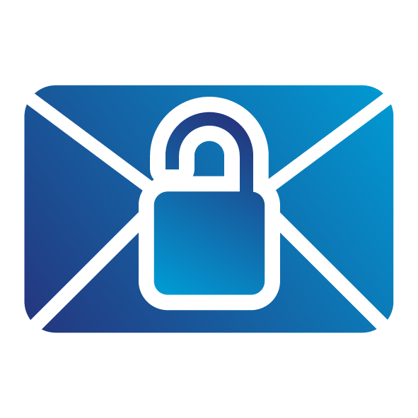

# A08:2021 – Fallas en el Software y en la Integridad de los Datos    {: style="height:80px;width:80px" align="right"}

## Factores

| CWEs mapeadas | Tasa de incidencia máx | Tasa de incidencia prom | Explotabilidad ponderada prom | Impacto ponderado prom | Cobertura máx | Cobertura prom | Incidencias totales | Total CVEs |
|:-------------:|:--------------------:|:--------------------:|:--------------:|:--------------:|:----------------------:|:---------------------:|:-------------------:|:------------:|
| 10          | 16.67%             | 2.05%              | 6.94                 | 7.94                | 75.04%       | 45.35%       | 47,972            | 1,152      |

## Resumen

Una nueva categoría en la versión 2021 que se centra en hacer suposiciones relacionadas con las actualizaciones de software, los datos críticos y los pipelines de CI/CD sin verificación de integridad. Corresponde a uno de los mayores impactos según los sistemas de ponderación de vulnerabilidades (CVE/CVSS, siglas en inglés para Common Vulnerability and Exposures/Common Vulnerability Scoring System). Entre estos, se destacan las siguientes CWEs:
*CWE-829: Inclusión de funcionalidades provenientes de fuera de la zona de confianza*,
*CWE-494: Ausencia de verificación de integridad en el código descargado*, y 
*CWE-502: Deserialización de datos no confiables*.

## Descripción 

Los fallos de integridad del software y de los datos están relacionados con código e infraestructura no protegidos contra alteraciones (integridad). Ejemplos de esto son cuando una aplicación depende de plugins, bibliotecas o módulos de fuentes, repositorios o redes de entrega de contenidos (CDN) no confiables.
Un pipeline CI/CD inseguro puede conducir a accesos no autorizados, la inclusión de código malicioso o el compromiso del sistema en general.
Además, es común en la actualidad que las aplicaciones implementen funcionalidades de actualización, a través de las cuales se descargan nuevas versiones de la misma sin las debidas verificaciones integridad que fueron realizadas previamente al instalar la aplicación. Los atacantes potencialmente pueden cargar sus propias actualizaciones para que sean distribuidas y ejecutadas en todas las instalaciones. Otro ejemplo es cuando objetos o datos son codificados o serializados en estructuras que un atacante puede ver y modificar, produciéndose una deserialización insegura.

## Cómo se previene

-   Utilice firmas digitales o mecanismos similares para verificar que el software o datos provienen efectivamente de la fuente esperada y no fueron alterados.

-   Asegúrese que las bibliotecas y dependencias, tales como npm o maven son utilizadas desde repositorios confiables. Si su perfil de riesgo es alto, considere alojarlas en un repositorio interno cuyo contenido ha sido previamente analizado.

-   Asegúrese que se utilice una herramienta de análisis de componentes de terceros, como OWASP Dependency Check u OWASP CycloneDX, con el fin de verificar la ausencia de vulnerabilidades conocidas.

-   Asegúrese que se utilice un proceso de revisión de cambios de código y configuraciones para minimizar las posibilidades de que código o configuraciones maliciosas sean introducidos en su pipeline.

-   Asegúrese que su pipeline CI/CD posee adecuados controles de acceso, segregación y configuraciones que permitan asegurar la integridad del código a través del proceso de build y despliegue.

-   Asegúrese que datos sin cifrar o firmar no son enviados a clientes no confiables sin alguna forma de verificación de integridad o firma electrónica con el fin de detectar modificaciones o la reutilización de datos previamente serializados. 

## Ejemplos de escenarios de ataque

**Escenario #1 Actualizaciones no firmadas:** Muchos routers domésticos, decodificadores de televisión, firmware de dispositivos, entre otros, no verifican las firmas de sus actualizaciones de firmware. El firmware sin firmar es un objetivo creciente para los atacantes y se espera que empeore. Esto es una gran preocupación, ya que muchas veces no existe otro mecanismo para remediarlo que corregirlo en una versión futura y esperar a que las versiones anteriores caduquen.

**Escenario #2 Actualización maliciosa de SolarWinds:** Se sabe que los Estados-Naciones utilizan como vector de ataque los mecanismos de actualización, siendo un caso reciente de pública notoriedad el sufrido por SolarWinds Orion. La compañía que desarrolla el software poseía procesos seguros de construcción y mecanismos de integridad en sus actualizaciones. Sin embargo, estos fueron comprometidos y, durante varios meses, la firma distribuyó una actualización maliciosa a más de 18.000 organizaciones, de las cuales alrededor de un centenar se vieron afectadas. Se trata de una de las brechas de este tipo de mayor alcance y más importantes de la historia.

**Escenario #3 Deserialización insegura:** Una aplicación *React* utiliza un conjunto de microservicios implementados en Spring Boot. Tratándose de programadores funcionales, intentaron asegurarse de que su código fuera inmutable. La solución implementada consistió en serializar el estado de la sesión para el usuario y enviarlo entre los componentes con cada solicitud. Un atacante advierte el uso de un objeto Java serializado y codificado en base64 (identifica un string que comienza con "rO0") y utiliza la herramienta *Java Serial Killer* para obtener una ejecución remota de código en el servidor de aplicación.

## Referencias

-   \[OWASP Cheat Sheet: Software Supply Chain Security\](Coming Soon)

-   \[OWASP Cheat Sheet: Secure build and deployment\](Coming Soon)

-    [OWASP Cheat Sheet: Infrastructure as Code](https://cheatsheetseries.owasp.org/cheatsheets/Infrastructure_as_Code_Security_Cheat_Sheet.html)

-   [OWASP Cheat Sheet: Deserialization](
    <https://www.owasp.org/index.php/Deserialization_Cheat_Sheet>)

-   [SAFECode Software Integrity Controls](
    https://safecode.org/publication/SAFECode_Software_Integrity_Controls0610.pdf)

-   [A 'Worst Nightmare' Cyberattack: The Untold Story Of The
    SolarWinds
    Hack](<https://www.npr.org/2021/04/16/985439655/a-worst-nightmare-cyberattack-the-untold-story-of-the-solarwinds-hack>)

-   [CodeCov Bash Uploader Compromise](https://about.codecov.io/security-update)

-   [Securing DevOps by Julien Vehent](https://www.manning.com/books/securing-devops)

## Lista de CWEs mapeadas

[CWE-345 Insufficient Verification of Data Authenticity](https://cwe.mitre.org/data/definitions/345.html)

[CWE-353 Missing Support for Integrity Check](https://cwe.mitre.org/data/definitions/353.html)

[CWE-426 Untrusted Search Path](https://cwe.mitre.org/data/definitions/426.html)

[CWE-494 Download of Code Without Integrity Check](https://cwe.mitre.org/data/definitions/494.html)

[CWE-502 Deserialization of Untrusted Data](https://cwe.mitre.org/data/definitions/502.html)

[CWE-565 Reliance on Cookies without Validation and Integrity Checking](https://cwe.mitre.org/data/definitions/565.html)

[CWE-784 Reliance on Cookies without Validation and Integrity Checking in a Security Decision](https://cwe.mitre.org/data/definitions/784.html)

[CWE-829 Inclusion of Functionality from Untrusted Control Sphere](https://cwe.mitre.org/data/definitions/829.html)

[CWE-830 Inclusion of Web Functionality from an Untrusted Source](https://cwe.mitre.org/data/definitions/830.html)

[CWE-915 Improperly Controlled Modification of Dynamically-Determined Object Attributes](https://cwe.mitre.org/data/definitions/915.html)
